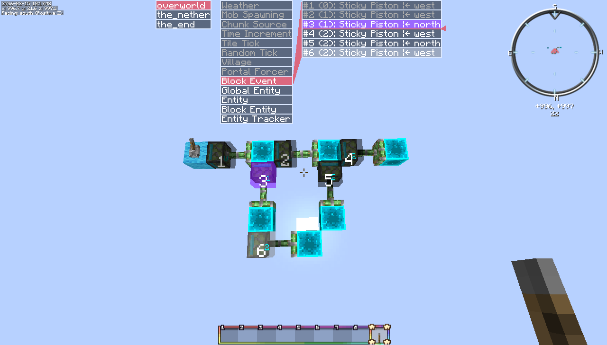
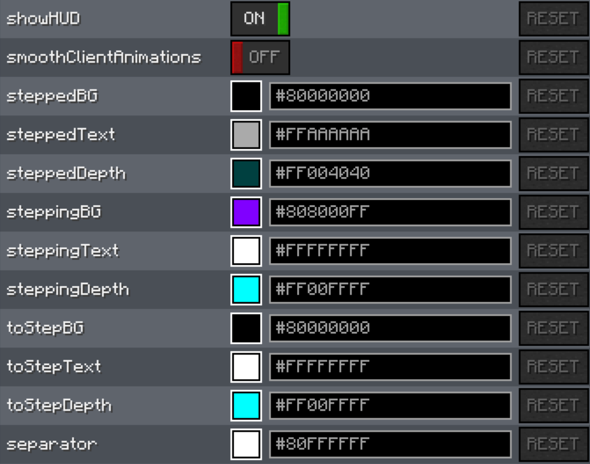
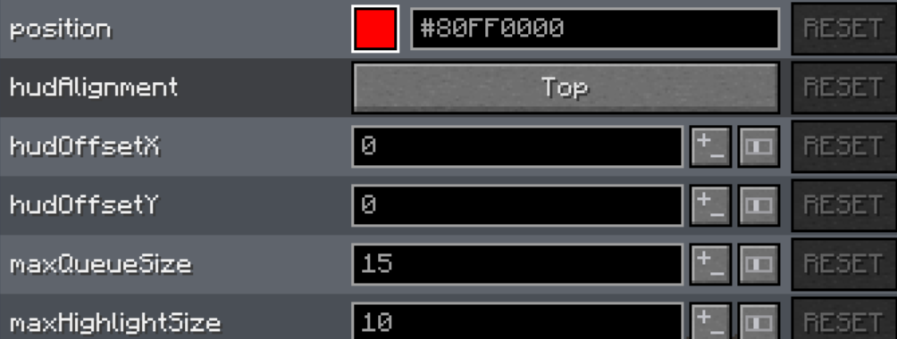

# SubTick Legacy

Subtick Legacy is forked from lntricate1's Subtick and licensed under LGPLv3 Original Project:

https://modrinth.com/mod/subtick

https://github.com/lntricate1/SubTick

Original License:

https://github.com/lntricate1/SubTick/blob/multi/LICENSE

## Commands

*[] represents an optional argument, and <> represents an obligatory argument. If an argument is written like `count=1`,
that means `1` is the default value.*

- `tick freeze [phase=subtickDefaultPhase]`: Freezes/unfreezes right before `phase`.
- `tick step [count=1] [phase=subtickDefaultPhase]`: Steps `count` ticks, ending right before `phase`. Supports
  `tick step 0 [phase]` to step to a later phase in the same tick.
- `phaseStep [count=1]`: Steps `count` phases forward, **stepping to the next tick if necessary**.
- `phaseStep <phase>`: Steps to `phase`, **within the current tick**.
- `phaseStep <phase> force`: Steps to the next `phase` **stepping to the next tick if necessary**.
- `queueStep <queue> [count=1]`: Steps through `count` elements in `queue`, **within the current tick**.
- `queueStep <queue> [count=1] force`: Steps through `count` elements in `queue`, **stepping to the next tick if
  necessary**.

### Special cases

Block events and block ticks have the option to use a different mode for stepping. Block events can step through whole
block event depths, and block ticks can step through whole block tick priorities.

- `queueStep blockEvent [mode=index] [count=1] [force]`
- `queueStep tileTick [mode=index] [count=1] [force]`

## Client config

To open the config menu, use Modmenu.

- SmoothClientAnimations: Smooth client animations with low tps settings.
- Stepped: The stuff that has already been stepped through.
- Stepping: The stuff that got stepped in the most recent queueStep.
- To Step: The stuff that has not been stepped through yet.
- Separator: The color used between and around the cells of the table.
- Position: The color used for the arrow and line indicating the current position in the tick.
- HUD Alignment: Which edge or corner of the screen the HUD is aligned to.
- HUD Offset: The offset in pixels from the aligned position.
- Max Queue Size: The maximum number of queue elements displayed in the HUD.
- Max Highlight Size: The maximum number of highlighted queue elements in the HUD.

## Carpet rules

This mod uses carpet rules for its configuration options. For how to use the text formatting, search for "
`format(components, ...)`"
in [Auxiliary.md](https://github.com/gnembon/fabric-carpet/blob/master/docs/scarpet/api/Auxiliary.md).

- `subtickDefaultPhase=tileTick`: The default tick phase to freeze at and step to, if it's not specified in the command.
- `subtickDefaultRange=32`: The default range within which to queueStep.
- `subtickTextFormat=ig`: The format for command feedback text.
- `subtickNumberFormat=iy`: The format for command feedback numbers.
- `subtickPhaseFormat=it`: The format for command feedback phases.
- `subtickDimensionFormat=im`: The format for command feedback dimensions.
- `subtickErrorFormat=ir`: The format for command feedback errors.
